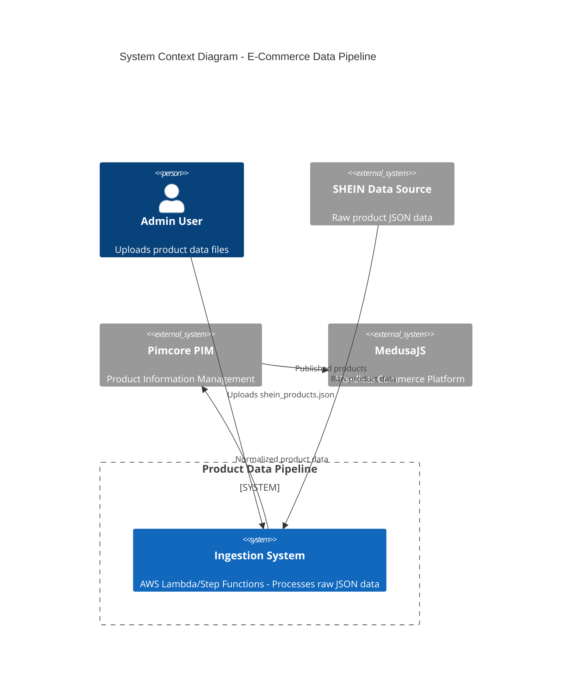
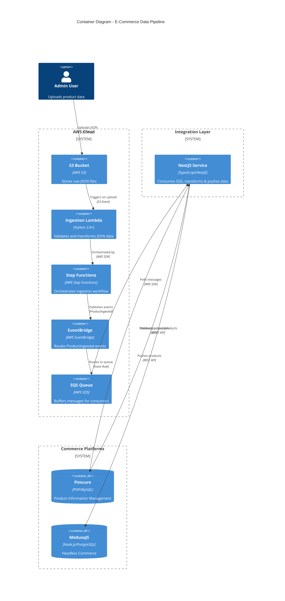
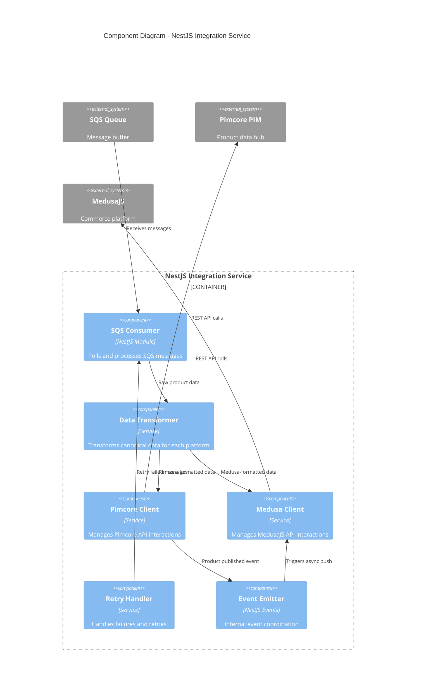

# C4 Architecture Diagrams

## Level 1: System Context Diagram



## Level 2: Container Diagram



## Level 3: Component Diagram - NestJS Integration Service



## Data Flow Sequence

```
┌─────────┐     ┌────┐     ┌────────┐     ┌─────────────┐     ┌─────┐     ┌────────┐     ┌─────────┐     ┌─────────┐
│  Admin  │     │ S3 │     │ Lambda │     │StepFunctions│     │EB   │     │  SQS   │     │ NestJS  │     │Pimcore/ │
│         │     │    │     │        │     │             │     │     │     │        │     │         │     │ Medusa  │
└────┬────┘     └──┬─┘     └───┬────┘     └──────┬──────┘     └──┬──┘     └───┬────┘     └────┬────┘     └────┬────┘
     │             │           │                 │               │            │               │               │
     │ Upload JSON │           │                 │               │            │               │               │
     │────────────>│           │                 │               │            │               │               │
     │             │           │                 │               │            │               │               │
     │             │ S3 Event  │                 │               │            │               │               │
     │             │──────────>│                 │               │            │               │               │
     │             │           │                 │               │            │               │               │
     │             │           │ Start Execution │               │            │               │               │
     │             │           │────────────────>│               │            │               │               │
     │             │           │                 │               │            │               │               │
     │             │           │<────────────────│               │            │               │               │
     │             │           │  Orchestrate    │               │            │               │               │
     │             │           │                 │               │            │               │               │
     │             │           │ ProductIngested │               │            │               │               │
     │             │           │ Event           │               │            │               │               │
     │             │           │────────────────────────────────>│            │               │               │
     │             │           │                 │               │            │               │               │
     │             │           │                 │               │ Route msg  │               │               │
     │             │           │                 │               │───────────>│               │               │
     │             │           │                 │               │            │               │               │
     │             │           │                 │               │            │  Poll Queue   │               │
     │             │           │                 │               │            │<──────────────│               │
     │             │           │                 │               │            │               │               │
     │             │           │                 │               │            │ Return Msgs   │               │
     │             │           │                 │               │            │──────────────>│               │
     │             │           │                 │               │            │               │               │
     │             │           │                 │               │            │               │ Upsert Product│
     │             │           │                 │               │            │               │──────────────>│
     │             │           │                 │               │            │               │               │
     │             │           │                 │               │            │               │<──────────────│
     │             │           │                 │               │            │               │   Success     │
     │             │           │                 │               │            │               │               │
     │             │           │                 │               │            │ Delete Msg    │               │
     │             │           │                 │               │            │<──────────────│               │
     │             │           │                 │               │            │               │               │
```
