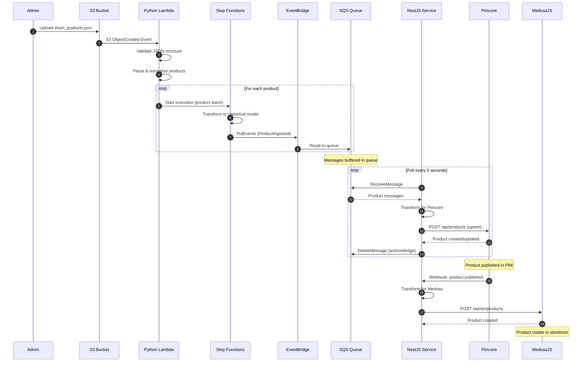
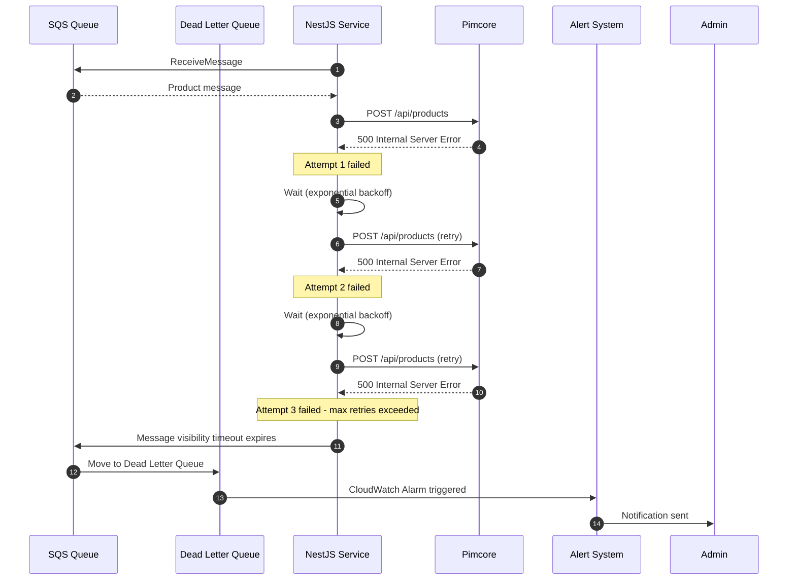
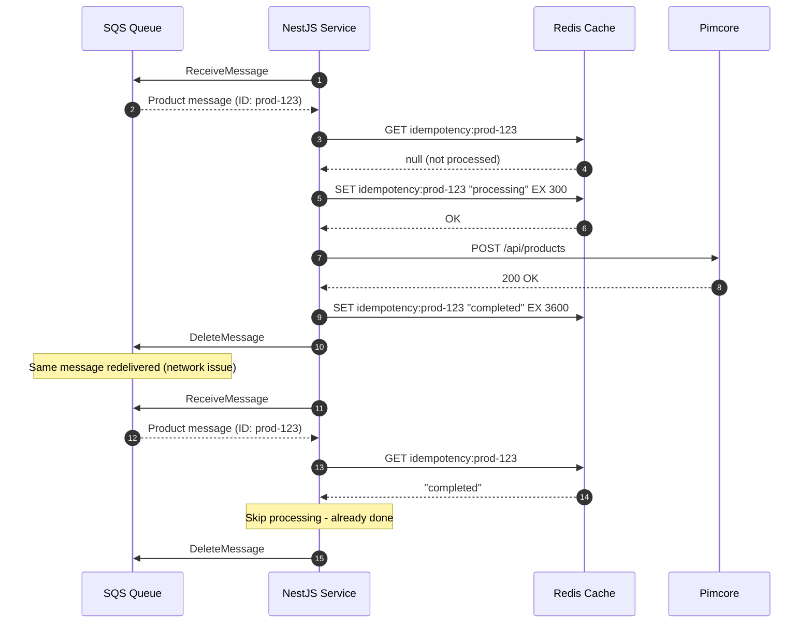
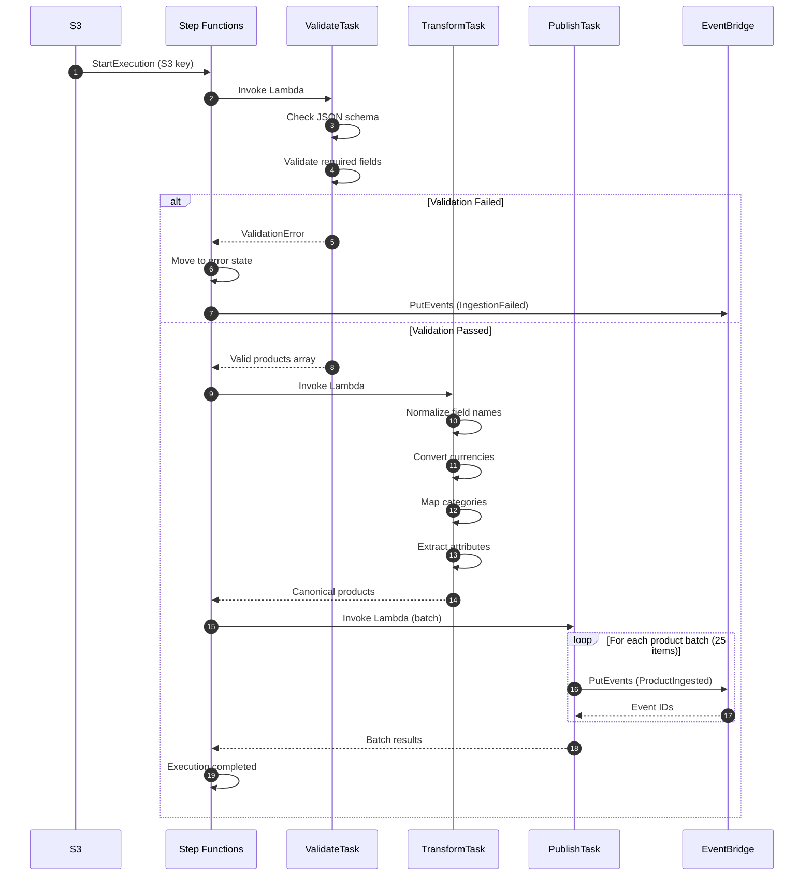

# Sequence Diagrams

## Main Data Flow Sequence

```mermaid
sequenceDiagram
    autonumber
    participant Admin
    participant S3 as S3 Bucket
    participant Lambda as Python Lambda
    participant StepFn as Step Functions
    participant EB as EventBridge
    participant SQS as SQS Queue
    participant NestJS as NestJS Service
    participant Pimcore
    participant Medusa as MedusaJS

    Admin->>S3: Upload shein_products.json
    S3->>Lambda: S3 ObjectCreated Event
    
    Lambda->>Lambda: Validate JSON structure
    Lambda->>Lambda: Parse & normalize products
    
    loop For each product
        Lambda->>StepFn: Start execution (product batch)
        StepFn->>StepFn: Transform to canonical model
        StepFn->>EB: PutEvents (ProductIngested)
        EB->>SQS: Route to queue
    end
    
    Note over SQS: Messages buffered in queue
    
    loop Poll every 5 seconds
        NestJS->>SQS: ReceiveMessage
        SQS-->>NestJS: Product messages
        
        NestJS->>NestJS: Transform for Pimcore
        NestJS->>Pimcore: POST /api/products (upsert)
        Pimcore-->>NestJS: Product created/updated
        
        NestJS->>SQS: DeleteMessage (acknowledge)
    end
    
    Note over Pimcore: Product published in PIM
    
    Pimcore->>NestJS: Webhook: product.published
    NestJS->>NestJS: Transform for Medusa
    NestJS->>Medusa: POST /admin/products
    Medusa-->>NestJS: Product created
    
    Note over Medusa: Product visible in storefront
```

## Error Handling Sequence

```mermaid
sequenceDiagram
    autonumber
    participant SQS as SQS Queue
    participant DLQ as Dead Letter Queue
    participant NestJS as NestJS Service
    participant Pimcore
    participant Alert as Alert System

    NestJS->>SQS: ReceiveMessage
    SQS-->>NestJS: Product message
    
    NestJS->>Pimcore: POST /api/products
    Pimcore-->>NestJS: 500 Internal Server Error
    
    Note over NestJS: Attempt 1 failed
    
    NestJS->>NestJS: Wait (exponential backoff)
    NestJS->>Pimcore: POST /api/products (retry)
    Pimcore-->>NestJS: 500 Internal Server Error
    
    Note over NestJS: Attempt 2 failed
    
    NestJS->>NestJS: Wait (exponential backoff)
    NestJS->>Pimcore: POST /api/products (retry)
    Pimcore-->>NestJS: 500 Internal Server Error
    
    Note over NestJS: Attempt 3 failed - max retries exceeded
    
    NestJS->>SQS: Message visibility timeout expires
    SQS->>DLQ: Move to Dead Letter Queue
    
    DLQ->>Alert: CloudWatch Alarm triggered
    Alert->>Admin: Notification sent
```

## Idempotency Handling Sequence

```mermaid
sequenceDiagram
    autonumber
    participant SQS as SQS Queue
    participant NestJS as NestJS Service
    participant Redis as Redis Cache
    participant Pimcore

    NestJS->>SQS: ReceiveMessage
    SQS-->>NestJS: Product message (ID: prod-123)
    
    NestJS->>Redis: GET idempotency:prod-123
    Redis-->>NestJS: null (not processed)
    
    NestJS->>Redis: SET idempotency:prod-123 "processing" EX 300
    Redis-->>NestJS: OK
    
    NestJS->>Pimcore: POST /api/products
    Pimcore-->>NestJS: 200 OK
    
    NestJS->>Redis: SET idempotency:prod-123 "completed" EX 3600
    NestJS->>SQS: DeleteMessage
    
    Note over SQS: Same message redelivered (network issue)
    
    NestJS->>SQS: ReceiveMessage
    SQS-->>NestJS: Product message (ID: prod-123)
    
    NestJS->>Redis: GET idempotency:prod-123
    Redis-->>NestJS: "completed"
    
    Note over NestJS: Skip processing - already done
    
    NestJS->>SQS: DeleteMessage
```

## Step Functions Workflow

```mermaid
sequenceDiagram
    autonumber
    participant S3
    participant SF as Step Functions
    participant Validate as ValidateTask
    participant Transform as TransformTask
    participant Publish as PublishTask
    participant EB as EventBridge

    S3->>SF: StartExecution (S3 key)
    
    SF->>Validate: Invoke Lambda
    Validate->>Validate: Check JSON schema
    Validate->>Validate: Validate required fields
    
    alt Validation Failed
        Validate-->>SF: ValidationError
        SF->>SF: Move to error state
        SF->>EB: PutEvents (IngestionFailed)
    else Validation Passed
        Validate-->>SF: Valid products array
        
        SF->>Transform: Invoke Lambda
        Transform->>Transform: Normalize field names
        Transform->>Transform: Convert currencies
        Transform->>Transform: Map categories
        Transform->>Transform: Extract attributes
        Transform-->>SF: Canonical products
        
        SF->>Publish: Invoke Lambda (batch)
        loop For each product batch (25 items)
            Publish->>EB: PutEvents (ProductIngested)
            EB-->>Publish: Event IDs
        end
        Publish-->>SF: Batch results
        
        SF->>SF: Execution completed
    end
```
